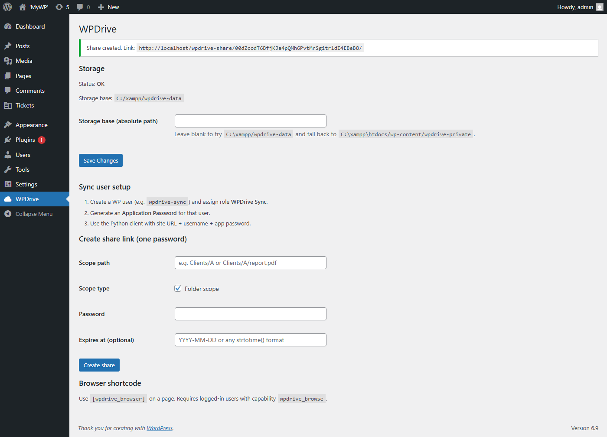
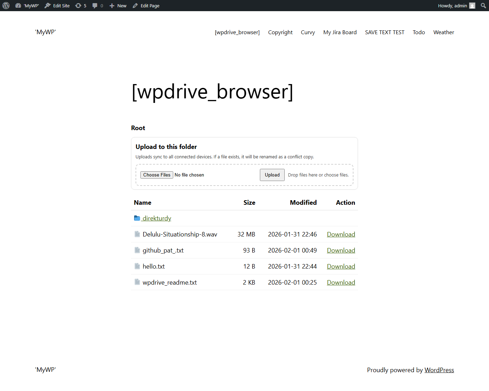
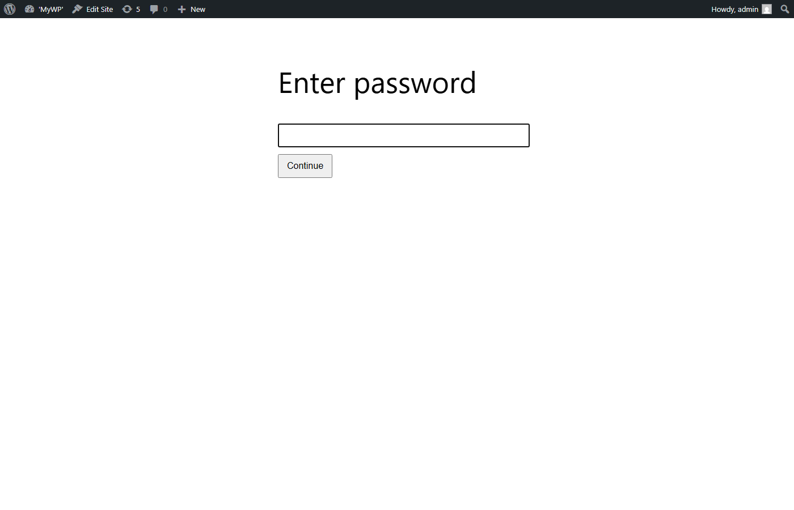
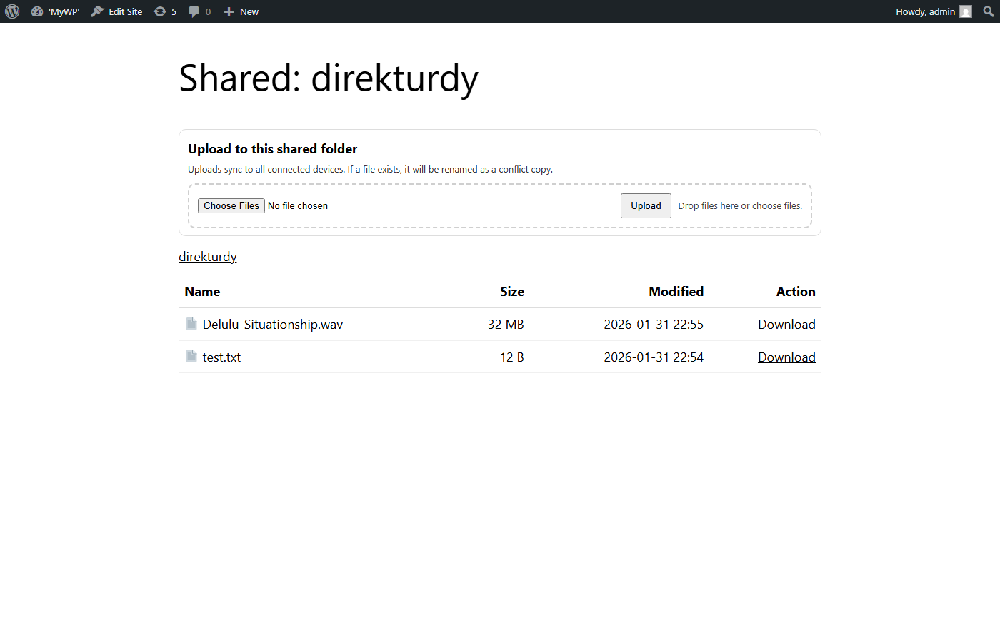

# WPDrive Sync (WordPress Plugin)

WPDrive Sync is the WordPress-side plugin that provides a private file store, a browser UI, share links, and a REST API used by the WPDrive sync client.

## What it does
- Stores files in a private directory outside the public web root when possible.
- Tracks file metadata and changes in database tables for sync.
- Exposes a REST API for chunked uploads and change polling.
- Provides a browser UI via `[wpdrive_browser]`.
- Creates password-protected share links for folders or single files.

## Architecture at a glance
### Storage
The plugin stores files in a private directory:
- Primary: `../wpdrive-data` (one level above WordPress root)
- Fallback: `wp-content/wpdrive-private`

The path can be overridden in **WP Admin -> WPDrive**. The plugin also writes a best-effort `.htaccess` and `index.html` to the storage base to reduce accidental public exposure.

### Database tables
The plugin creates four tables on activation:
- `wp_wpdrive_entries` - file metadata and revisions
- `wp_wpdrive_changes` - change log for sync clients
- `wp_wpdrive_uploads` - in-progress chunked uploads
- `wp_wpdrive_shares` - share links (token, scope, password hash)

### REST API (for sync clients)
All REST routes are under `wpdrive/v1` and require a user with `wpdrive_sync` capability (via WP Application Passwords).

Endpoints:
- `GET /changes` - poll changes since a change_id
- `POST /upload/init` - start a chunked upload (returns upload_id)
- `POST /upload/chunk` - upload a chunk at a byte offset
- `POST /upload/finalize` - finalize upload and commit entry
- `POST /delete` - mark a path as deleted and create a change
- `GET /list` - list children of a path
- `GET /download` - download a file (supports HTTP range)

For share links, `list` and `download` can also be accessed with a share token.

### Conflict handling
If a client uploads a file using a stale `base_rev`, the server resolves it by renaming the incoming upload using a conflict name that includes the device label and timestamp.

## Installation
1) Copy this folder to `/wp-content/plugins/wpdrive-plugin/`.
2) Activate **WPDrive Sync**.
3) Go to **WP Admin -> WPDrive** and confirm storage status.

## User setup (sync client)
1) Create a WordPress user for syncing (e.g., `wpdrive-sync`).
2) Assign the **WPDrive Sync** role.
3) Generate an **Application Password** for that user.
4) Use the WPDrive sync client with site URL + username + app password.

## Capabilities and roles
The plugin uses these custom capabilities:
- `wpdrive_manage` - admin menu + settings + share creation
- `wpdrive_browse` - access to the browser shortcode
- `wpdrive_sync` - REST API access for sync clients

Admins receive all three. A **WPDrive Sync** role is created with `wpdrive_sync` only.

## Browser shortcode
Add `[wpdrive_browser]` to a page. The browser UI:
- Lists files and folders from the private store
- Provides download links for files
- Uses `?wpdrive_path=...` for navigation

Only logged-in users with `wpdrive_browse`, `wpdrive_manage`, or `wpdrive_sync` can view it.

## Share links
Create share links in **WP Admin -> WPDrive**:
- Scope can be a folder or a single file
- Each share has a password and optional expiration
- Access is via `/wpdrive-share/<token>/`
- Access is authorized by a short-lived cookie after password entry

## Optional extension: WPDrive Web Uploads
The `wpdrive-web-uploads` plugin adds drag-and-drop uploads to the browser UI and to password-protected folder share pages. It writes proper WPDrive entries and change log rows so sync clients pick up new files.

## Screenshots
Admin settings page:

Browser shortcode page (with web uploads enabled):

Share link password prompt:

Share link folder view (with web uploads enabled):

## License
Proprietary. Internal use only. Not licensed for public redistribution.
